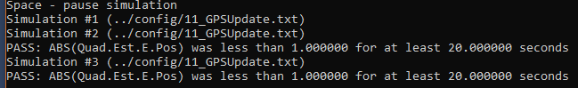

# Estimation Project #

Welcome to the estimation project.  In this project, you will be developing the estimation portion of the controller used in the CPP simulator.  By the end of the project, your simulated quad will be flying with your estimator and your custom controller (from the previous project)!


### Step 1: Sensor Noise ###

For the controls project, the simulator was working with a perfect set of sensors, meaning none of the sensors had any noise.  The first step to adding additional realism to the problem, and developing an estimator, is adding noise to the quad's sensors.  For the first step, you will collect some simulated noisy sensor data and estimate the standard deviation of the quad's sensor.

<p align="center">

</p>

Standard deviation calculation is conducted using "calc_std.py" which utilizes numpy std utility.
<p align="center">

</p>

***Success criteria:*** *Your standard deviations should accurately capture the value of approximately 68% of the respective measurements.*

<p align="center">

</p>

NOTE: Your answer should match the settings in `SimulatedSensors.txt`, where you can also grab the simulated noise parameters for all the other sensors.


### Step 2: Attitude Estimation ###

Now let's look at the first step to our state estimation: including information from our IMU.  In this step, you will be improving the complementary filter-type attitude filter with a better rate gyro attitude integration scheme.
```
  ////////////////////////////// BEGIN STUDENT CODE ///////////////////////////
  // SMALL ANGLE GYRO INTEGRATION:
  // (replace the code below)
  // make sure you comment it out when you add your own code -- otherwise e.g. you might integrate yaw twice

  // float predictedPitch = pitchEst + dtIMU * gyro.y;
  // float predictedRoll = rollEst + dtIMU * gyro.x;
  // ekfState(6) = ekfState(6) + dtIMU * gyro.z;	// yaw
  
  float phi = rollEst;
  float theta = pitchEst;
  
  //Develop rotation matrix
  Mat3x3F rot_mat = Mat3x3F();
  
  rot_mat(0,0) = 1.0;
  rot_mat(0,1) = sin(phi)*tan(theta);
  rot_mat(0,2) = cos(phi)*tan(theta);
  
  rot_mat(1,0) = 0.0;
  rot_mat(1,1) = cos(phi);
  rot_mat(1,2) = -sin(phi);
  
  rot_mat(2,0) = 0.0;
  rot_mat(2,1) = sin(phi)/cos(theta);
  rot_mat(2,2) = cos(phi)/cos(theta);
  
  V3F euler_angle_dot=rot_mat*gyro;
  
  float predictedRoll = rollEst + dtIMU*euler_angle_dot.x;
  float predictedPitch = pitchEst + dtIMU*euler_angle_dot.y;
  ekfState(6) = ekfState(6) + dtIMU*euler_angle_dot.z;
  
  

  // normalize yaw to -pi .. pi
  if (ekfState(6) > F_PI) ekfState(6) -= 2.f*F_PI;
  if (ekfState(6) < -F_PI) ekfState(6) += 2.f*F_PI;

  /////////////////////////////// END STUDENT CODE ////////////////////////////
```

<p align="center">

</p>

***Success criteria:*** *Your attitude estimator needs to get within 0.1 rad for each of the Euler angles for at least 3 seconds.*
<p align="center">

</p>

### Step 3: Prediction Step ###

In this next step you will be implementing the prediction step of your filter.


1. Run scenario `08_PredictState`.  This scenario is configured to use a perfect IMU (only an IMU). Due to the sensitivity of double-integration to attitude errors, we've made the accelerometer update very insignificant (`QuadEstimatorEKF.attitudeTau = 100`).  The plots on this simulation show element of your estimated state and that of the true state.  At the moment you should see that your estimated state does not follow the true state.

2. In `QuadEstimatorEKF.cpp`, implement the state prediction step in the `PredictState()` functon. If you do it correctly, when you run scenario `08_PredictState` you should see the estimator state track the actual state, with only reasonably slow drift, as shown in the figure below:
```
  ////////////////////////////// BEGIN STUDENT CODE ///////////////////////////
  //From body to inertial frame
  V3F accel_inertial = attitude.Rotate_BtoI(accel);
  //Dead reckoning
  predictedState(0) = curState(0) + curState(3)*dt;
  predictedState(1) = curState(1) + curState(4)*dt;
  predictedState(2) = curState(2) + curState(5)*dt;
  
  predictedState(3) = curState(3) + accel_inertial.x*dt;
  predictedState(4) = curState(4) + accel_inertial.y*dt;
  predictedState(5) = curState(5) + accel_inertial.z*dt - CONST_GRAVITY*dt;
	

  /////////////////////////////// END STUDENT CODE ////////////////////////////
```
<p align="center">

</p>

3. Now let's introduce a realistic IMU, one with noise.  Run scenario `09_PredictionCov`. You will see a small fleet of quadcopter all using your prediction code to integrate forward. You will see two plots:
   - The top graph shows 10 (prediction-only) position X estimates
   - The bottom graph shows 10 (prediction-only) velocity estimates
You will notice however that the estimated covariance (white bounds) currently do not capture the growing errors.

4. In `QuadEstimatorEKF.cpp`, calculate the partial derivative of the body-to-global rotation matrix in the function `GetRbgPrime()`.  Once you have that function implement, implement the rest of the prediction step (predict the state covariance forward) in `Predict()`.

**Hint: see section 7.2 of [Estimation for Quadrotors](https://www.overleaf.com/read/vymfngphcccj) for a refresher on the the transition model and the partial derivatives you may need**

**Hint: When it comes to writing the function for GetRbgPrime, make sure to triple check you've set all the correct parts of the matrix.**

##### General Theory
<p align="center">

</p>
<p align="center">

</p>

```
////////////////////////////// BEGIN STUDENT CODE ///////////////////////////
  float theta = pitch;
  float phi = roll;
  float psi = yaw;
  //From section 7.2
  RbgPrime(0,0)=-cos(theta)*sin(psi);
  RbgPrime(0,1)=-sin(phi)*sin(theta)*sin(psi)-cos(phi)*cos(psi);
  RbgPrime(0,2)=-cos(phi)*sin(theta)*sin(psi)+sin(phi)*cos(psi);
  
  RbgPrime(1,0)=cos(theta)*cos(psi);
  RbgPrime(1,1)=sin(phi)*sin(theta)*cos(psi)-cos(phi)*cos(psi);
  RbgPrime(1,2)=cos(phi)*sin(theta)*cos(psi)+sin(phi)*cos(psi);
  
  RbgPrime(2,0)=0.0;
  RbgPrime(2,1)=0.0;
  RbgPrime(2,2)=0.0;
  


/////////////////////////////// END STUDENT CODE ////////////////////////////
```
**Hint: recall that the control input is the acceleration!**

5. Run your covariance prediction and tune the `QPosXYStd` and the `QVelXYStd` process parameters in `QuadEstimatorEKF.txt` to try to capture the magnitude of the error you see. Note that as error grows our simplified model will not capture the real error dynamics (for example, specifically, coming from attitude errors), therefore  try to make it look reasonable only for a relatively short prediction period (the scenario is set for one second).  

```
  ////////////////////////////// BEGIN STUDENT CODE ///////////////////////////
  gPrime(0,3)=dt;
  gPrime(1,4)=dt;
  gPrime(2,5)=dt;
  
  gPrime(3,6) = (RbgPrime(0)*accel).sum()*dt;
  gPrime(4,6) = (RbgPrime(1)*accel).sum()*dt;
  gPrime(5,6) = (RbgPrime(2)*accel).sum()*dt;
  
  //From EKF algorithm
  ekfCov=gPrime * ekfCov * gPrime.transpose() +Q;
  


  /////////////////////////////// END STUDENT CODE ////////////////////////////
```

```
QPosXYStd = .05
QPosZStd = .05
QVelXYStd = .2
QVelZStd = .1
QYawStd = .05
```

***Success criteria:*** *This step doesn't have any specific measurable criteria being checked.*
<p align="center">

</p>

### Step 4: Magnetometer Update ###

Up until now we've only used the accelerometer and gyro for our state estimation.  In this step, you will be adding the information from the magnetometer to improve your filter's performance in estimating the vehicle's heading.

1. Run scenario `10_MagUpdate`.  This scenario uses a realistic IMU, but the magnetometer update hasn’t been implemented yet. As a result, you will notice that the estimate yaw is drifting away from the real value (and the estimated standard deviation is also increasing).  Note that in this case the plot is showing you the estimated yaw error (`quad.est.e.yaw`), which is drifting away from zero as the simulation runs.  You should also see the estimated standard deviation of that state (white boundary) is also increasing.

2. Tune the parameter `QYawStd` (`QuadEstimatorEKF.txt`) for the QuadEstimatorEKF so that it approximately captures the magnitude of the drift, as demonstrated here:

```
QYawStd = .08
```


3. Implement magnetometer update in the function `UpdateFromMag()`.  

```
  ////////////////////////////// BEGIN STUDENT CODE ///////////////////////////
  hPrime(0,6)=1;
  
  zFromX(0) = ekfState(6);
  float measured_estimated_diff = magYaw-zFromX(0);
  
  if (measured_estimated_diff>F_PI)
  {
	  zFromX(0)+=2.f*F_PI;
  }
  else if(measured_estimated_diff<-F_PI)
  {
	  zFromX(0)-=2.f*F_PI;
  }


  /////////////////////////////// END STUDENT CODE ////////////////////////////
```
Once completed,

<p align="center">

</p>

***Success criteria:*** *Your goal is to both have an estimated standard deviation that accurately captures the error and maintain an error of less than 0.1rad in heading for at least 10 seconds of the simulation.*

<p align="center">

</p>


### Step 5: Closed Loop + GPS Update ###

1. Run scenario `11_GPSUpdate`.  At the moment this scenario is using both an ideal estimator and and ideal IMU.  Even with these ideal elements, watch the position and velocity errors (bottom right). As you see they are drifting away, since GPS update is not yet implemented.

2. Let's change to using your estimator by setting `Quad.UseIdealEstimator` to 0 in `config/11_GPSUpdate.txt`.  Rerun the scenario to get an idea of how well your estimator work with an ideal IMU.

3. Now repeat with realistic IMU by commenting out these lines in `config/11_GPSUpdate.txt`:
```
#SimIMU.AccelStd = 0,0,0
#SimIMU.GyroStd = 0,0,0
```

4. Tune the process noise model in `QuadEstimatorEKF.txt` to try to approximately capture the error you see with the estimated uncertainty (standard deviation) of the filter.
```
GPSPosZStd = 300
```

5. Implement the EKF GPS Update in the function `UpdateFromGPS()`.

```
  ////////////////////////////// BEGIN STUDENT CODE ///////////////////////////
  zFromX(0) = ekfState(0);
  zFromX(1) = ekfState(1);
  zFromX(2) = ekfState(2);
  zFromX(3) = ekfState(3);
  zFromX(4) = ekfState(4);
  zFromX(5) = ekfState(5);
  
  hPrime(0,0)=1;
  hPrime(1,1)=1;
  hPrime(2,2)=1;
  hPrime(3,3)=1;
  hPrime(4,4)=1;
  hPrime(5,5)=1;

  /////////////////////////////// END STUDENT CODE ////////////////////////////
```

6. Now once again re-run the simulation.  Your objective is to complete the entire simulation cycle with estimated position error of < 1m (you’ll see a green box over the bottom graph if you succeed).  You may want to try experimenting with the GPS update parameters to try and get better performance.

<p align="center">

</p>

***Success criteria:*** *Your objective is to complete the entire simulation cycle with estimated position error of < 1m.*

<p align="center">

</p>

At this point, congratulations on having a working estimator!

### Step 6: Adding Your Controller ###

Up to this point, we have been working with a controller that has been relaxed to work with an estimated state instead of a real state.  So now, you will see how well your controller performs and de-tune your controller accordingly.

1. Replace `QuadController.cpp` with the controller you wrote in the last project.

2. Replace `QuadControlParams.txt` with the control parameters you came up with in the last project.

3. Run scenario `11_GPSUpdate`. If your controller crashes immediately do not panic. Flying from an estimated state (even with ideal sensors) is very different from flying with ideal pose. You may need to de-tune your controller. Decrease the position and velocity gains (we’ve seen about 30% detuning being effective) to stabilize it.  Your goal is to once again complete the entire simulation cycle with an estimated position error of < 1m.

<p align="center">

</p>

***Success criteria:*** *Your objective is to complete the entire simulation cycle with estimated position error of < 1m.*


## Submission ##

For this project, you will need to submit:

 - a completed estimator that meets the performance criteria for each of the steps by submitting:
   - `QuadEstimatorEKF.cpp`
   - `config/QuadEstimatorEKF.txt`

 - a re-tuned controller that, in conjunction with your tuned estimator, is capable of meeting the criteria laid out in Step 6 by submitting:
   - `QuadController.cpp`
   - `config/QuadControlParams.txt`

 - a write up addressing all the points of the rubric


